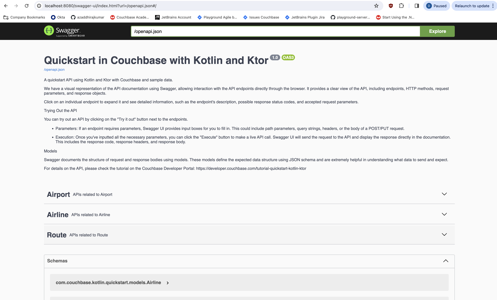

# Quickstart in Couchbase with Kotlin and Ktor

#### REST API using Couchbase Capella in Kotlin and Ktor

Often, the first step developers do after creating their database is to create a REST API that can perform Create, Read, Update, and Delete (CRUD) operations for that database. This repo is designed to teach you and give you a starter project (in Kotlin using Ktor) to generate such a REST API. After you have installed travel-sample bucket in your database, you can run this application which is a REST API with Swagger documentation so that you can learn:

1. How to create, read, update, and delete documents using [Key Value operations](https://docs.couchbase.com/kotlin-sdk/current/howtos/kv-operations.html) (KV operations). KV operations are unique to couchbase and provide super fast (think microseconds) queries.
2. How to write simple parametrized [SQL++ queries](https://docs.couchbase.com/kotlin-sdk/current/howtos/n1ql-queries.html) using the built-in travel-sample bucket.

Full documentation can be found on the [Couchbase Developer Portal](https://developer.couchbase.com/tutorial-quickstart-kotlin-ktor).

## Prerequisites
To run this prebuilt project, you will need:

- [Couchbase Capella](https://www.couchbase.com/products/capella/) cluster with [travel-sample](https://docs.couchbase.com/kotlin-sdk/current/ref/travel-app-data-model.html) bucket loaded.
    - To run this tutorial using a self managed Couchbase cluster, please refer to the [appendix](#running-self-managed-couchbase-cluster).
- [Java SDK v1.8](https://www.oracle.com/java/technologies/downloads/) or higher installed.
    - Ensure that the Java version is [compatible](https://docs.couchbase.com/kotlin-sdk/current/project-docs/compatibility.html) with the Couchbase SDK.
- Code Editor installed (Vim, IntelliJ IDEA, Eclipse, or Visual Studio Code)
- Loading Travel Sample Bucket
    - If travel-sample is not loaded in your Capella cluster, you can load it by following the instructions for your Capella Cluster:
        - [Load travel-sample bucket in Couchbase Capella](https://docs.couchbase.com/cloud/clusters/data-service/import-data-documents.html#import-sample-data)

## App Setup

We will walk through the different steps required to get the application running.

### Cloning Repo

```shell
git clone https://github.com/couchbase-examples/kotlin-quickstart
```

### Install Dependencies

```shell
gradle build
```
### Dependency Injection via Couchbase Koin module

The quickstart code provides a Koin module that exports configuration, cluster, bucket and scope beans to the application.
```
// Creates a cluster bean
fun createCluster(configuration: CouchbaseConfiguration): Cluster {
  return Cluster.connect(
    connectionString = configuration.connectionString,
    username = configuration.username,
    password = configuration.password,
  )
}


// Creates a bucket bean
@ExperimentalTime
fun createBucket(cluster: Cluster, configuration: CouchbaseConfiguration): Bucket {
  val result : Bucket?
  runBlocking {
    result = cluster.bucket(configuration.bucket).waitUntilReady(10.seconds)
  }
  return result!!
}

// Creates a bucket scope bean
fun createScope(bucket: Bucket, configuration: CouchbaseConfiguration): Scope {
  return bucket.scope(configuration.scope)
}
```
> _from [`src/main/kotlin/com/couchbase/kotlin/quickstart/CouchbaseConfiguration.kt`](https://github.com/couchbase-examples/kotlin-quickstart/blob/main/src/main/kotlin/com/couchbase/kotlin/quickstart/CouchbaseConfiguration.kt)_

Configured database objects like the bucket and scope must exist on the cluster prior to starting the application.

### Setup Database Configuration

To know more about connecting to your Capella cluster, please follow the [instructions](https://docs.couchbase.com/cloud/get-started/connect.html).

Specifically, you need to do the following:

- Create the [database credentials](https://docs.couchbase.com/cloud/clusters/manage-database-users.html) to access the travel-sample bucket (Read and Write) used in the application.
- [Allow access](https://docs.couchbase.com/cloud/clusters/allow-ip-address.html) to the Cluster from the IP on which the application is running.

All configuration for communication with the database is stored in the `src/main/resources/application.conf` file under the `couchbase` section:

```
couchbase {
    connectionString = "localhost"
    username = "Administrator"
    password = "password"
    bucket = "travel-sample"
    scope = "inventory"
}
```
> _from [`src/main/resources/application.conf`](https://github.com/couchbase-examples/kotlin-quickstart/blob/main/src/main/resources/application.conf)_

This includes the connection string, username, password, bucket and scope names. The default username is assumed to be `Administrator` and the default password is assumed to be `password`.
If these are different in your environment you will need to change them before running the application.

## Running The Application

### Directly on Machine

At this point, we have installed the dependencies, loaded the travel-sample data and configured the application with the credentials. The application is now ready and you can run it.

```shell
./gradlew run
```

### Using Docker

- Build the Docker image

```shell 
docker build -t couchbase-koltin-quickstart .
```

- Run the docker image

```shell 
docker run -e DB_CONN_STR=<connection_string> -e DB_USERNAME=<user_with_read_write_permission_to_travel-sample_bucket> -e DB_PASSWORD=<password_for_user> -p 8080:8080 couchbase-koltin-quickstart
```

You can access the Application on http://0.0.0.0:8080

### Verifying the Application

Once the application starts, you can see the details of the application on the logs.


The application will run on port 8080 of your local machine (http://0.0.0.0:8080). You will find the Swagger documentation of the API if you go to the URL in your browser.
Swagger documentation is used in this demo to showcase the different API end points and how they can be invoked. More details on the Swagger documentation can be found in the [appendix](#swagger-documentation).



## Running Tests

To run the standard integration tests, use the following command:

```sh
./gradlew test
```

## Appendix

### Data Model

For this quickstart, we use three collections, airport, airline and routes that contain sample airports, airlines and airline routes respectively. The routes collection connects the airports and airlines as seen in the figure below. We use these connections in the quickstart to generate airports that are directly connected and airlines connecting to a destination airport. Note that these are just examples to highlight how you can use SQL++ queries to join the collections.


### Extending API by Adding New Entity

If you would like to add another entity to the APIs, these are the steps to follow:

- Create the new entity (collection) in the Couchbase bucket. You can create the collection using the [SDK](https://docs.couchbase.com/sdk-api/couchbase-net-client/api/Couchbase.Management.Collections.ICouchbaseCollectionManager.html#Couchbase_Management_Collections_ICouchbaseCollectionManager_CreateCollectionAsync_Couchbase_Management_Collections_CollectionSpec_Couchbase_Management_Collections_CreateCollectionOptions_) or via the [Couchbase Server interface](https://docs.couchbase.com/cloud/n1ql/n1ql-language-reference/createcollection.html).
- Define the routes in a file inside the `src/main/kotlin/com/couchbase/kotlin/quickstart/routes` folder similar to the existing routes.
- Define the services in a new file inside the `src/main/kotlin/com/couchbase/kotlin/quickstart/services` folder similar to the existing services.
- Define the repository for this collection inside a new file inside the `src/main/kotlin/com/couchbase/kotlin/quickstart/repositories` folder similar to the existing repositories.
- Add the tests for the new routes in a new file in the `src/test/kotlin/com/couchbase/kotlin/quickstart` folder similar to the existing ones.

### Running Self Managed Couchbase Cluster

If you are running this quickstart with a self managed Couchbase cluster, you need to [load](https://docs.couchbase.com/server/current/manage/manage-settings/install-sample-buckets.html) the travel-sample data bucket in your cluster and generate the credentials for the bucket.

You need to update the connection string and the credentials in the [`src/main/resources/application.conf`](https://github.com/couchbase-examples/kotlin-quickstart/blob/main/src/main/resources/application.conf) file in the source folder.

> **NOTE:** Couchbase must be installed and running prior to running the the ASP.NET app.

### Swagger Documentation

Swagger documentation provides a clear view of the API including endpoints, HTTP methods, request parameters, and response objects.

Click on an individual endpoint to expand it and see detailed information. This includes the endpoint's description, possible response status codes, and the request parameters it accepts.

#### Trying Out the API

You can try out an API by clicking on the "Try it out" button next to the endpoints.

- Parameters: If an endpoint requires parameters, Swagger UI provides input boxes for you to fill in. This could include path parameters, query strings, headers, or the body of a POST/PUT request.

- Execution: Once you've inputted all the necessary parameters, you can click the "Execute" button to make a live API call. Swagger UI will send the request to the API and display the response directly in the documentation. This includes the response code, response headers, and response body.

#### Models

Swagger documents the structure of request and response bodies using models. These models define the expected data structure using JSON schema and are extremely helpful in understanding what data to send and expect.